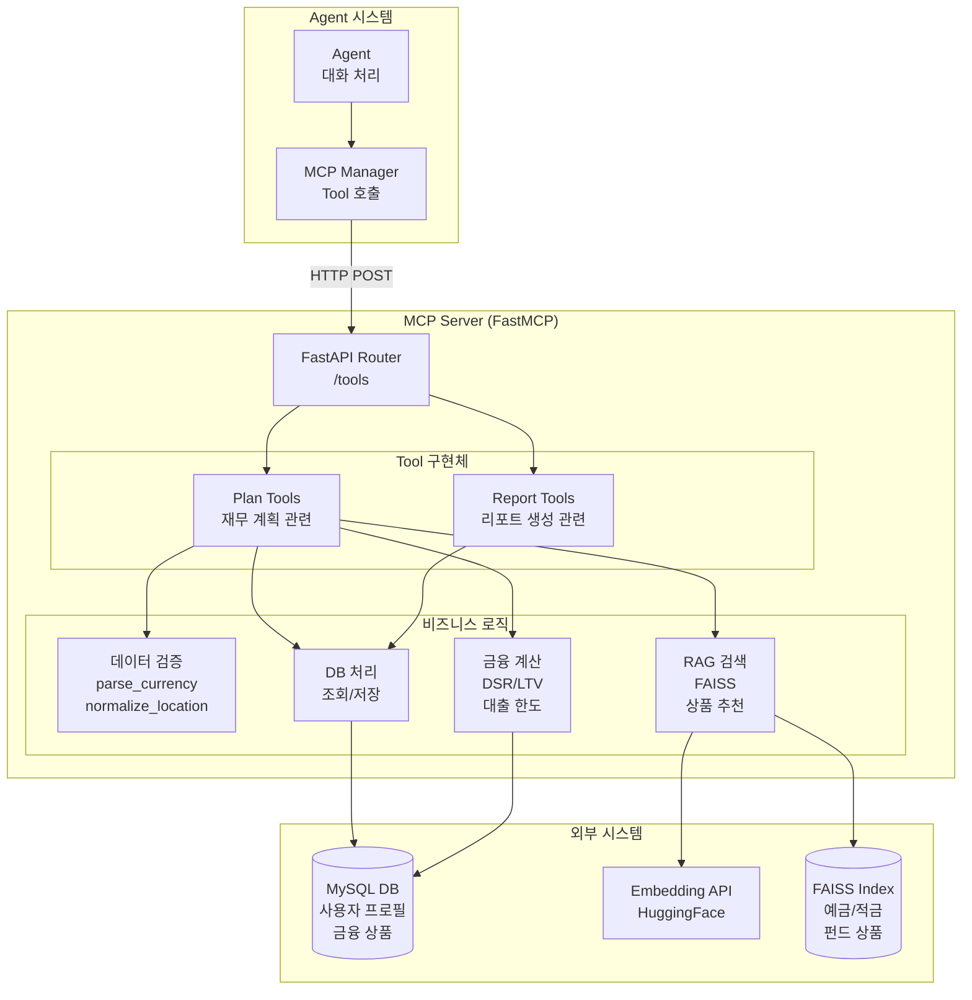
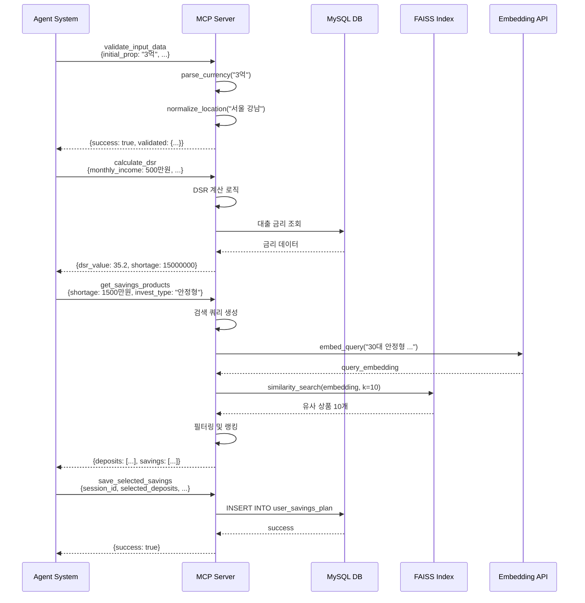

# MCP Server - 기술문서

> FastMCP 기반 금융 Agent를 위한 Tool 제공 서버

## 📋 목차

- [프로젝트 개요](#-프로젝트-개요)
- [시스템 아키텍처](#-시스템-아키텍처)
- [Tool 시스템 설계](#-tool-시스템-설계)
- [핵심 컴포넌트](#-핵심-컴포넌트)
- [Tool 목록 및 상세](#-tool-목록-및-상세)
- [프로젝트 구조](#-프로젝트-구조)
- [기술 스택](#-기술-스택)
- [빠른 시작](#-빠른-시작)

---

## 🎯 프로젝트 개요

### 개발 의도

본 MCP Server는 **Model Context Protocol(MCP)**을 구현하여 Agent가 외부 시스템과 상호작용할 수 있도록 **표준화된 Tool 인터페이스**를 제공합니다. 금융 상품 조회, 대출 계산, 데이터 검증, DB 저장 등 다양한 비즈니스 로직을 **재사용 가능한 Tool**로 캡슐화하여 Agent 시스템과 분리된 독립적인 서비스로 운영됩니다.

### 핵심 설계 철학

1. **Tool의 재사용성**: 하나의 Tool을 여러 Agent에서 공통으로 사용
2. **비즈니스 로직 분리**: Agent는 대화 흐름에 집중, MCP는 실제 작업 수행
3. **표준화된 인터페이스**: Pydantic 스키마 기반 명확한 입출력 정의
4. **RAG 기반 상품 검색**: FAISS를 활용한 의미론적 유사도 검색
5. **확장 가능한 구조**: 새로운 Tool 추가 시 기존 시스템에 영향 없음

### MCP의 역할

```
┌─────────────┐         ┌──────────────┐         ┌─────────────┐
│   Agent     │ ──Tool──▶│  MCP Server  │ ──SQL──▶│   MySQL DB  │
│  (대화 처리)  │ ◀─Result─│ (비즈니스 로직)│ ◀─Data──│  (영구 저장)  │
└─────────────┘         └──────────────┘         └─────────────┘
```

---

## 🏗️ 시스템 아키텍처

### 전체 아키텍처 다이어그램



### 서비스 흐름도



---

## 🛠️ Tool 시스템 설계

### Tool 구조

모든 Tool은 다음 구조를 따릅니다:

```python
# 1. Pydantic 스키마 정의 (server/schemas/plan_schema.py)
class ToolNameRequest(BaseModel):
    """Tool 입력 스키마"""
    param1: str = Field(..., description="파라미터 설명")
    param2: int = Field(default=0, description="선택적 파라미터")

class ToolNameResponse(BaseModel):
    """Tool 출력 스키마"""
    tool_name: str = Field(default="tool_name")
    success: bool = Field(..., description="처리 성공 여부")
    result: Dict = Field(..., description="결과 데이터")
    error: Optional[str] = Field(None, description="에러 메시지")

# 2. FastAPI 엔드포인트 구현 (server/api/tools/plan_agent_tools.py)
@router.post("/tool_name", response_model=ToolNameResponse)
async def tool_name(req: ToolNameRequest = Body(...)):
    """
    Tool 설명
    
    Args:
        req: 입력 파라미터
        
    Returns:
        처리 결과
    """
    try:
        # 비즈니스 로직 수행
        result = perform_business_logic(req)
        
        return ToolNameResponse(
            success=True,
            result=result
        )
    except Exception as e:
        return ToolNameResponse(
            success=False,
            error=str(e)
        )
```

### Tool 카테고리

| 카테고리 | 역할 | Tool 개수 |
|---------|------|----------|
| **Validation** | 입력 데이터 검증 및 정규화 | 4개 |
| **Calculation** | 금융 계산 (DSR/LTV, 대출 한도 등) | 3개 |
| **Search** | RAG 기반 상품 검색 | 3개 |
| **Database** | 사용자 데이터 조회/저장 | 8개 |
| **Utility** | 헬스체크, 완료 확인 등 | 2개 |

---

## 🔧 핵심 컴포넌트

### 1. FastMCP Integration

**위치**: `server/mcp_server.py`

FastMCP를 사용하여 FastAPI 앱을 MCP Protocol로 변환합니다.

```python
from fastmcp import FastMCP
from fastapi import FastAPI

# Tool API 정의
tools_app = FastAPI()
tools_app.include_router(plan_tools_router)
tools_app.include_router(report_tools_router)

# MCP로 변환
mcp = FastMCP.from_fastapi(
    tools_app,
    name="fisa-mcp",
    instructions="금융 상품 검색, 대출 계산, DB 조회 Tool 제공",
    version="0.1.0"
)

# HTTP Transport 제공
mcp_app = mcp.http_app(
    path="/",
    transport="http",
    stateless_http=False,
    json_response=True
)
```

**특징**:
- FastAPI 엔드포인트를 자동으로 MCP Tool로 변환
- Pydantic 스키마를 MCP Tool Schema로 자동 매핑
- HTTP 기반 stateful/stateless 통신 지원

### 2. RAG 기반 상품 검색

**위치**: `server/api/tools/plan_agent_tools.py`

FAISS를 활용한 의미론적 유사도 검색으로 사용자에게 최적의 금융 상품을 추천합니다.

```python
# FAISS 인덱스 로드
def _load_plan_deposit_faiss():
    """예금 상품 인덱스 로드"""
    index_path = BASE_DIR / "faiss_deposit_products"
    
    if not index_path.exists():
        logger.warning(f"FAISS index not found: {index_path}")
        return None
    
    embeddings = _get_embeddings()
    faiss_store = FAISS.load_local(
        str(index_path),
        embeddings,
        allow_dangerous_deserialization=True
    )
    return faiss_store

# 검색 쿼리 생성
def _build_search_query_from_user(user_profile: Dict):
    """사용자 프로필을 자연어 쿼리로 변환"""
    age = user_profile.get("age", "미상")
    invest_type = user_profile.get("invest_type", "안정형")
    target_amount = user_profile.get("shortage_amount", 0)
    
    query = f"{age}세 {invest_type} 투자 성향, "
    query += f"{target_amount:,}원 목표 자금을 위한 상품"
    
    return query

# 상품 검색 및 필터링
@router.post("/get_savings_products")
async def get_savings_products(req: GetSavingsProductsRequest):
    """예·적금 상품 검색"""
    # 1. FAISS 검색
    query = _build_search_query_from_user(req.user_profile)
    deposit_store = _load_plan_deposit_faiss()
    saving_store = _load_plan_saving_faiss()
    
    deposits = deposit_store.similarity_search(query, k=10)
    savings = saving_store.similarity_search(query, k=10)
    
    # 2. 필터링 (금리, 기간, 은행 등)
    filtered_deposits = _filter_by_criteria(deposits, req.filters)
    filtered_savings = _filter_by_criteria(savings, req.filters)
    
    # 3. Top 3 선정
    top_deposits = sorted(filtered_deposits, 
                          key=lambda x: x.metadata['interest_rate'], 
                          reverse=True)[:3]
    top_savings = sorted(filtered_savings, 
                         key=lambda x: x.metadata['interest_rate'], 
                         reverse=True)[:3]
    
    return GetSavingsProductsResponse(
        success=True,
        deposits=top_deposits,
        savings=top_savings
    )
```

**RAG 프로세스**:
1. **인덱스 구축**: 금융 상품 데이터를 Embedding API로 벡터화하여 FAISS 인덱스 생성
2. **쿼리 생성**: 사용자 프로필(나이, 투자 성향, 목표 금액)을 자연어 쿼리로 변환
3. **유사도 검색**: 쿼리 벡터와 상품 벡터 간 코사인 유사도로 Top-K 추출
4. **필터링**: 금리, 기간, 은행 등 추가 조건으로 필터링
5. **랭킹**: 금리 등 핵심 지표로 최종 Top 3 선정

### 3. 금융 계산 엔진

**위치**: `server/api/tools/plan_agent_tools.py`

DSR(총부채상환비율), LTV(주택담보대출비율) 등 복잡한 금융 계산을 수행합니다.

```python
@router.post("/calculate_dsr")
async def calculate_dsr(req: CalculateDsrRequest):
    """
    DSR(총부채상환비율) 계산
    
    DSR = (연간 총 대출 원리금 상환액 / 연간 소득) × 100
    """
    try:
        # 1. 연간 소득 계산
        annual_income = req.monthly_income * 12
        
        # 2. 예상 대출액 계산 (주택 가격 - 초기 자본금)
        loan_amount = req.house_price - req.initial_capital
        
        # 3. DB에서 대출 금리 조회
        with engine.connect() as conn:
            result = conn.execute(text("""
                SELECT interest_rate 
                FROM loan_products 
                WHERE loan_type = :loan_type
                ORDER BY interest_rate ASC
                LIMIT 1
            """), {"loan_type": req.loan_type})
            
            rate = result.scalar() or 3.5  # 기본 금리
        
        # 4. 월 상환액 계산 (원리금 균등 상환)
        monthly_rate = rate / 100 / 12
        num_payments = req.loan_period * 12
        
        monthly_payment = (
            loan_amount * monthly_rate * 
            (1 + monthly_rate) ** num_payments
        ) / ((1 + monthly_rate) ** num_payments - 1)
        
        # 5. DSR 계산
        annual_payment = monthly_payment * 12
        dsr_value = (annual_payment / annual_income) * 100
        
        # 6. 대출 가능 여부 판단 (DSR 40% 제한)
        max_dsr = 40
        is_eligible = dsr_value <= max_dsr
        
        # 7. 부족 자금 계산
        if is_eligible:
            shortage = 0
        else:
            # DSR 40%로 조정 시 대출 가능액
            max_loan = (annual_income * max_dsr / 100) / 12
            adjusted_loan = calculate_loan_amount(max_loan, rate, num_payments)
            shortage = loan_amount - adjusted_loan
        
        return CalculateDsrResponse(
            success=True,
            dsr_value=round(dsr_value, 2),
            monthly_payment=int(monthly_payment),
            is_eligible=is_eligible,
            shortage_amount=int(shortage),
            recommended_loan=int(loan_amount - shortage)
        )
        
    except Exception as e:
        logger.error(f"DSR calculation error: {e}")
        return CalculateDsrResponse(
            success=False,
            error=str(e)
        )
```

### 4. 데이터 검증 및 정규화

입력 데이터의 일관성을 보장하기 위한 변환 Tool들:

```python
# 금액 파싱
@router.post("/parse_currency")
async def parse_currency(req: ParseCurrencyRequest):
    """
    한국어 금액 표현을 숫자로 변환
    
    예: "3억 5천만원" → 350000000
        "5천" → 5000000
    """
    value = req.value
    
    # 이미 숫자인 경우
    if isinstance(value, (int, float)):
        return ParseCurrencyResponse(success=True, parsed=int(value))
    
    # 한국어 파싱
    text = str(value).replace(',', '').replace('원', '').strip()
    
    # 단위 매핑
    units = {
        '억': 100000000,
        '천만': 10000000,
        '만': 10000,
        '천': 1000
    }
    
    total = 0
    for unit, multiplier in units.items():
        if unit in text:
            parts = text.split(unit)
            if parts[0]:
                total += int(parts[0]) * multiplier
            text = parts[1] if len(parts) > 1 else ""
    
    # 나머지 숫자
    if text and text.isdigit():
        total += int(text)
    
    return ParseCurrencyResponse(success=True, parsed=total)

# 지역 정규화
@router.post("/normalize_location")
async def normalize_location(req: NormalizeLocationRequest):
    """
    지역명을 표준 행정구역명으로 변환
    
    예: "강남" → "서울특별시 강남구"
        "분당" → "경기도 성남시 분당구"
    """
    location_map = {
        "강남": "서울특별시 강남구",
        "서초": "서울특별시 서초구",
        "분당": "경기도 성남시 분당구",
        # ... 매핑 데이터
    }
    
    normalized = location_map.get(req.location, req.location)
    
    return NormalizeLocationResponse(
        success=True,
        normalized=normalized
    )
```

### 5. 데이터베이스 연동

**위치**: `server/api/resources/db_tools.py`

SQLAlchemy를 사용한 MySQL 연동:

```python
from sqlalchemy import create_engine, text
from sqlalchemy.pool import QueuePool

# Connection Pool 설정
engine = create_engine(
    f"mysql+pymysql://{DB_USER}:{DB_PASSWORD}@{DB_HOST}/{DB_NAME}",
    poolclass=QueuePool,
    pool_size=5,
    max_overflow=10,
    pool_timeout=30,
    pool_recycle=3600
)

# 사용자 프로필 조회
@router.post("/get_user_profile")
async def get_user_profile(req: GetUserProfileRequest):
    """사용자 기본 프로필 조회"""
    try:
        with engine.connect() as conn:
            result = conn.execute(text("""
                SELECT 
                    user_id, name, age, occupation,
                    monthly_income, invest_type
                FROM user_profiles
                WHERE session_id = :session_id
            """), {"session_id": req.session_id})
            
            row = result.fetchone()
            
            if not row:
                return GetUserProfileResponse(
                    success=False,
                    error="User profile not found"
                )
            
            profile = {
                "user_id": row[0],
                "name": row[1],
                "age": row[2],
                "occupation": row[3],
                "monthly_income": row[4],
                "invest_type": row[5]
            }
            
            return GetUserProfileResponse(
                success=True,
                profile=profile
            )
            
    except Exception as e:
        return GetUserProfileResponse(
            success=False,
            error=str(e)
        )

# 재무 계획 저장
@router.post("/save_loan_result")
async def save_loan_result(req: SaveLoanResultRequest):
    """대출 계획 결과 저장"""
    try:
        with engine.begin() as conn:
            conn.execute(text("""
                INSERT INTO user_loan_plans 
                (session_id, loan_amount, loan_type, 
                 monthly_payment, dsr_value, created_at)
                VALUES 
                (:session_id, :loan_amount, :loan_type, 
                 :monthly_payment, :dsr_value, NOW())
            """), {
                "session_id": req.session_id,
                "loan_amount": req.loan_amount,
                "loan_type": req.loan_type,
                "monthly_payment": req.monthly_payment,
                "dsr_value": req.dsr_value
            })
        
        return SaveLoanResultResponse(success=True)
        
    except Exception as e:
        return SaveLoanResultResponse(
            success=False,
            error=str(e)
        )
```

---

## 📊 Tool 목록 및 상세

### Plan Tools (재무 계획)

| Tool 명 | 설명 | 입력 | 출력 |
|---------|------|------|------|
| **parse_currency** | 금액 파싱 | `value: str/int` | `parsed: int` |
| **normalize_location** | 지역 정규화 | `location: str` | `normalized: str` |
| **parse_ratio** | 비율 파싱 | `value: str/int` | `ratio: int` |
| **validate_input_data** | 입력 검증 | `data: Dict` | `validated: Dict, missing: List` |
| **check_plan_completion** | 입력 완료 확인 | `messages: List` | `is_complete: bool` |
| **calculate_dsr** | DSR 계산 | `income, house_price, loan_type` | `dsr_value, shortage` |
| **calculate_shortage** | 부족 자금 계산 | `plan_data: Dict` | `shortage_amount: int` |
| **get_loan_products** | 대출 상품 조회 | `loan_type, amount` | `products: List` |
| **get_savings_products** | 예·적금 검색 | `user_profile, filters` | `deposits, savings: List` |
| **get_fund_products** | 펀드 상품 검색 | `risk_level, amount` | `funds: List` |
| **save_loan_result** | 대출 계획 저장 | `session_id, loan_data` | `success: bool` |
| **save_selected_savings** | 예·적금 선택 저장 | `session_id, products` | `success: bool` |
| **save_selected_funds** | 펀드 선택 저장 | `session_id, funds` | `success: bool` |
| **get_user_profile** | 사용자 프로필 조회 | `session_id` | `profile: Dict` |

### Report Tools (리포트 생성)

| Tool 명 | 설명 | 입력 | 출력 |
|---------|------|------|------|
| **get_user_full_profile** | 전체 프로필 조회 | `session_id` | `profile: Dict` |
| **save_final_report** | 최종 리포트 저장 | `session_id, report` | `success: bool` |
| **get_market_summary** | 시장 동향 조회 | `category` | `summary: str` |

---

## 📁 프로젝트 구조

```
mcp/
├── main.py                     # FastAPI 서버 진입점
├── mcp.json                    # MCP 설정 파일
├── requirements.txt            # 의존성
│
├── config/
│   └── logger.py              # 로깅 설정
│
├── server/
│   ├── mcp_server.py          # FastMCP 초기화
│   │
│   ├── api/                   # Tool API 구현
│   │   ├── tools/
│   │   │   ├── plan_agent_tools.py      # Plan 관련 Tool (20개)
│   │   │   └── report_agent_tools.py    # Report 관련 Tool (3개)
│   │   │
│   │   └── resources/
│   │       ├── db_tools.py              # DB 조회 Tool
│   │       └── report_db_tools.py       # Report DB Tool
│   │
│   ├── routes/                # FastAPI Router
│   │   ├── mcp_route.py       # MCP Tool 라우트
│   │   └── data_route.py      # Resource 라우트
│   │
│   ├── schemas/               # Pydantic 스키마
│   │   ├── plan_schema.py     # Plan Tool 스키마 (109개 클래스)
│   │   └── report_schema.py   # Report Tool 스키마
│   │
│   ├── data/                  # 데이터 처리
│   │   └── policy_documents/  # 정책 문서 (RAG용)
│   │
│   ├── rag/                   # RAG 시스템
│   │   ├── faiss_deposit_products/   # 예금 인덱스
│   │   ├── faiss_saving_products/    # 적금 인덱스
│   │   └── faiss_fund_products/      # 펀드 인덱스
│   │
│   └── core/
│       └── config.py          # 설정 관리
│
├── faiss_deposit_products/    # FAISS 인덱스 (예금)
│   ├── index.faiss
│   └── index.pkl
│
├── faiss_saving_products/     # FAISS 인덱스 (적금)
│   ├── index.faiss
│   └── index.pkl
│
└── faiss_fund_products/        # FAISS 인덱스 (펀드)
    ├── index.faiss
    └── index.pkl
```

### 주요 디렉토리 설명

#### `server/api/tools/`
- **plan_agent_tools.py**: 재무 계획 수립 관련 모든 Tool (검증, 계산, 검색, 저장)
- **report_agent_tools.py**: 리포트 생성 관련 Tool (프로필 조회, 통계 등)

#### `server/schemas/`
- **plan_schema.py**: 109개의 Pydantic 클래스로 모든 Tool의 입출력 정의
- **report_schema.py**: Report Tool 스키마

#### `server/rag/`
- FAISS 인덱스 저장 위치
- 금융 상품 데이터의 벡터 표현

#### `server/data/policy_documents/`
- 금융 정책 문서 (향후 RAG 확장용)

---

## 🛠️ 기술 스택

### Backend
- **Python 3.11+**
- **FastAPI**: 고성능 비동기 웹 프레임워크
- **FastMCP**: MCP Protocol 구현
- **Pydantic**: 데이터 검증 및 스키마 정의

### Database
- **MySQL**: 사용자 데이터, 금융 상품 저장
- **SQLAlchemy**: ORM 및 Connection Pool

### Vector Search
- **FAISS**: 고속 유사도 검색
- **LangChain**: RAG 파이프라인
- **HuggingFace API**: Embedding 생성 (Qwen3-Embedding-8B)

### Utilities
- **Pandas**: 데이터 처리
- **NumPy**: 수치 계산

---

## 🚀 빠른 시작

### 개발 환경 설정

```bash
# 1. MCP 디렉토리로 이동
cd /Users/kimseonguk/Desktop/Final_Project/mcp

# 2. 의존성 설치
pip install -r requirements.txt
# 또는 uv 사용
uv sync

# 3. 환경 변수 설정
cp .env.sample .env
# .env 파일 편집:
# - DB_HOST, DB_USER, DB_PASSWORD, DB_NAME
# - EMBEDDING_API_URL

# 4. FAISS 인덱스 확인
ls faiss_deposit_products/  # index.faiss, index.pkl 존재 확인
ls faiss_saving_products/
ls faiss_fund_products/

# 5. 서버 실행
python main.py

# 또는 uvicorn 직접 실행
uvicorn main:app --host 0.0.0.0 --port 8888 --reload
```

### Docker 실행

```bash
# 1. 환경 변수 설정
cp .env.sample .env

# 2. Docker 빌드 및 실행
docker-compose up -d

# 3. 로그 확인
docker-compose logs -f mcp
```

### API 테스트

```bash
# 1. 헬스체크
curl http://localhost:8888/api/tools/health

# 2. 금액 파싱
curl -X POST http://localhost:8888/api/tools/parse_currency \
  -H "Content-Type: application/json" \
  -d '{"value": "3억 5천만원"}'

# 3. 예·적금 상품 검색
curl -X POST http://localhost:8888/api/tools/get_savings_products \
  -H "Content-Type: application/json" \
  -d '{
    "user_profile": {
      "age": 30,
      "invest_type": "안정형",
      "shortage_amount": 15000000
    }
  }'

# 4. DSR 계산
curl -X POST http://localhost:8888/api/tools/calculate_dsr \
  -H "Content-Type: application/json" \
  -d '{
    "monthly_income": 5000000,
    "house_price": 500000000,
    "initial_capital": 150000000,
    "loan_type": "주택담보대출",
    "loan_period": 30
  }'
```

### MCP Tool 목록 조회

```bash
# FastMCP 엔드포인트를 통한 Tool 목록 조회
curl http://localhost:8888/mcp/tools
```

---

## 🔍 주요 특징

### 1. **Pydantic 기반 타입 안전성**
- 모든 Tool의 입출력이 명확하게 정의됨
- 런타임 데이터 검증 자동화
- IDE 자동완성 지원

### 2. **RAG 기반 지능형 검색**
- 사용자 프로필을 자연어 쿼리로 변환
- FAISS 유사도 검색으로 관련 상품 추출
- 금리, 기간 등 추가 조건으로 필터링

### 3. **Connection Pool 관리**
- SQLAlchemy QueuePool로 DB 연결 재사용
- Pool 크기: 5개, Max overflow: 10개
- Connection timeout: 30초

### 4. **외부 Embedding API 활용**
- PC 서버의 HuggingFace API 사용
- GPU 기반 빠른 임베딩 생성
- 모델: Qwen/Qwen3-Embedding-8B

### 5. **확장 가능한 구조**
- 새로운 Tool 추가 시 기존 코드 수정 불필요
- Router에 포함만 하면 자동으로 MCP Tool로 등록
- Pydantic 스키마만 정의하면 OpenAPI 자동 생성

---

## 📊 성능 및 제약사항

### FAISS 인덱스 크기
- **예금 상품**: 약 1,000개
- **적금 상품**: 약 1,200개
- **펀드 상품**: 약 500개

### 검색 성능
- **유사도 검색**: ~10ms (FAISS)
- **필터링**: ~5ms
- **전체 프로세스**: ~50ms

### DB 연결
- **Pool 크기**: 5개 연결
- **최대 연결**: 15개 (5 + 10 overflow)
- **타임아웃**: 30초

### Embedding API
- **타임아웃**: 30초
- **배치 크기**: 최대 100개 텍스트
- **응답 시간**: ~200ms/배치

---

## 🐛 트러블슈팅

### FAISS 인덱스 로드 실패
```bash
# 인덱스 파일 확인
ls -la faiss_deposit_products/
# index.faiss와 index.pkl이 모두 있어야 함

# 권한 확인
chmod 644 faiss_deposit_products/*
```

### DB 연결 오류
```bash
# MySQL 연결 테스트
mysql -h $DB_HOST -u $DB_USER -p $DB_NAME

# Connection Pool 상태 확인 (로그에서)
# "Pool size: 5, Overflow: 0/10, Checked out: 3"
```

### Embedding API 타임아웃
```python
# .env 파일에서 타임아웃 조정
EMBEDDING_API_TIMEOUT=60.0
```

---

## 📝 환경 변수

```bash
# Database
DB_HOST=localhost
DB_PORT=3306
DB_USER=root
DB_PASSWORD=your_password
DB_NAME=fisa_db

# Embedding API
EMBEDDING_API_URL=http://pc-server:8000/embed
EMBEDDING_API_TIMEOUT=30.0

# Server
MCP_HOST=0.0.0.0
MCP_PORT=8888
```

---

## 🧪 테스트

```bash
# 단위 테스트
pytest tests/ -v

# 특정 Tool 테스트
pytest tests/test_plan_tools.py::test_parse_currency -v

# 커버리지
pytest --cov=server --cov-report=html
```

---

## 📈 향후 개선 방향

1. **캐싱**: Redis를 활용한 상품 검색 결과 캐싱
2. **비동기 DB**: aiomysql로 완전 비동기 처리
3. **검색 고도화**: Hybrid Search (BM25 + Vector)
4. **모니터링**: Prometheus + Grafana 대시보드
5. **Tool 버저닝**: Tool 스키마 버전 관리

---

## 🤝 기여

MCP Server는 Agent 시스템과 독립적으로 개발 및 배포됩니다.

### Tool 추가 방법

1. **스키마 정의**: `server/schemas/plan_schema.py`에 Request/Response 추가
2. **Tool 구현**: `server/api/tools/plan_agent_tools.py`에 엔드포인트 추가
3. **Router 등록**: 자동으로 MCP Tool로 등록됨
4. **테스트**: 단위 테스트 및 통합 테스트 작성

---

## 📄 라이선스

MIT License

---

## 📞 문의

MCP Server 관련 문의사항은 이슈로 등록해 주세요.